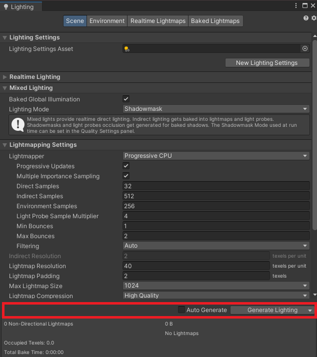
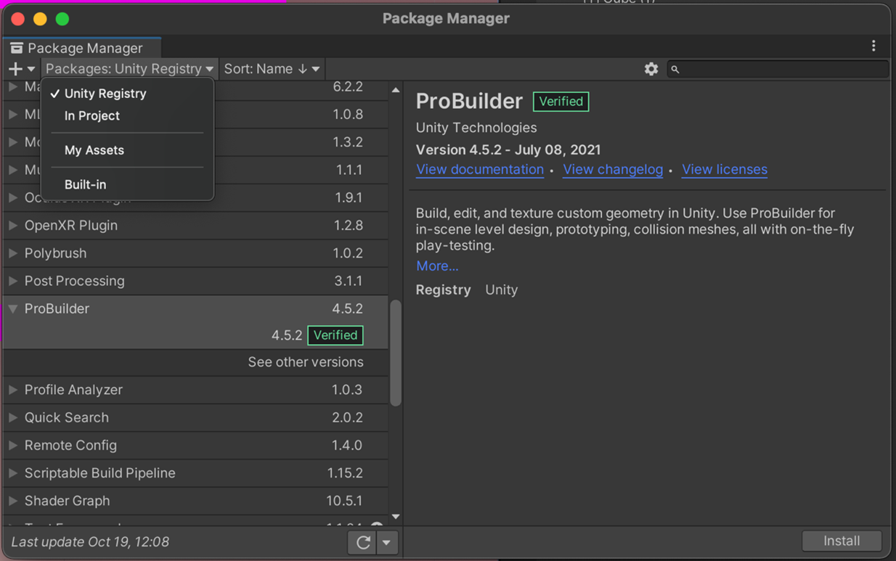
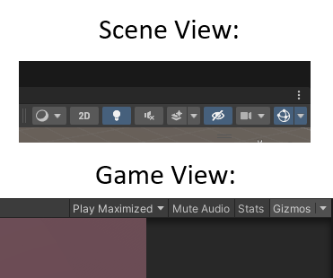
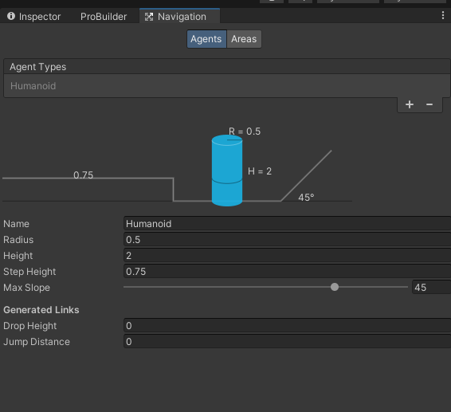
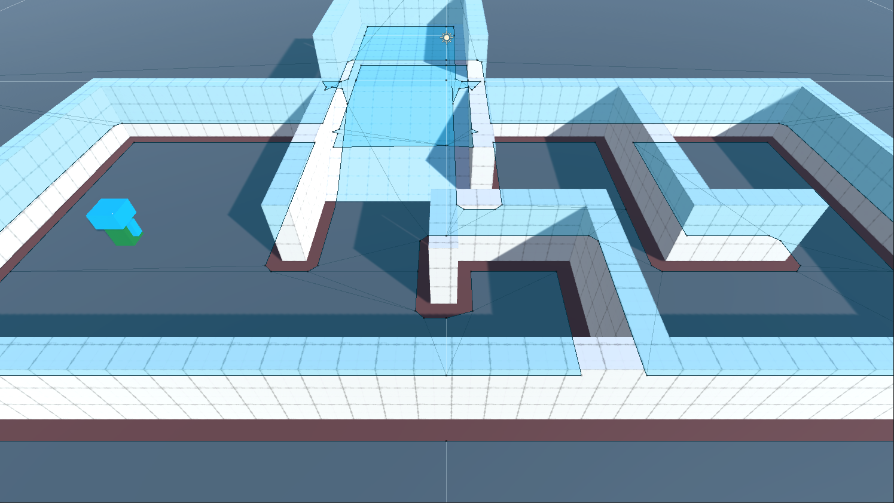
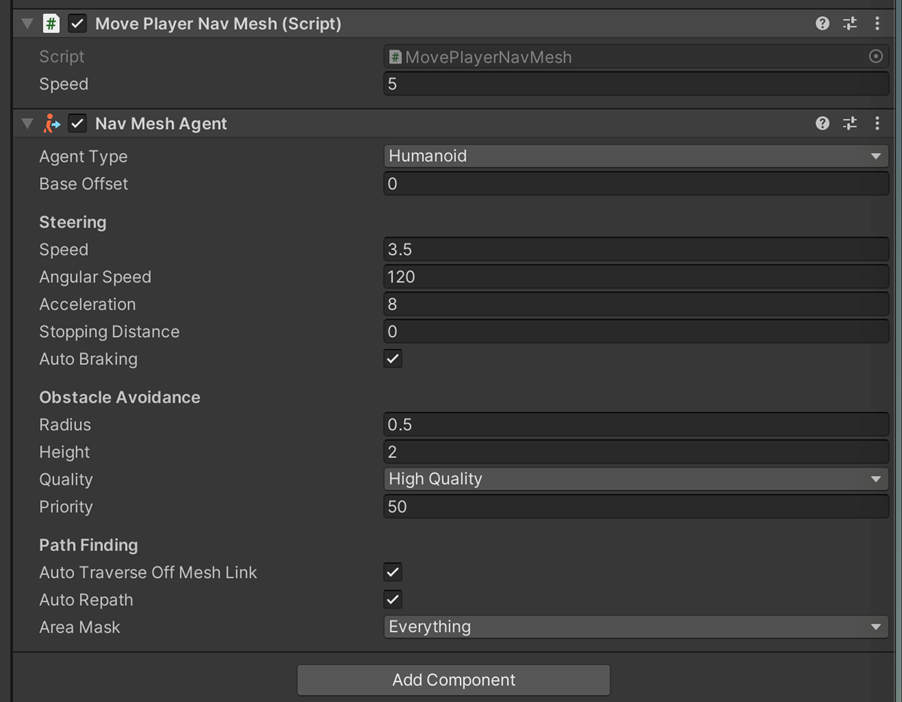
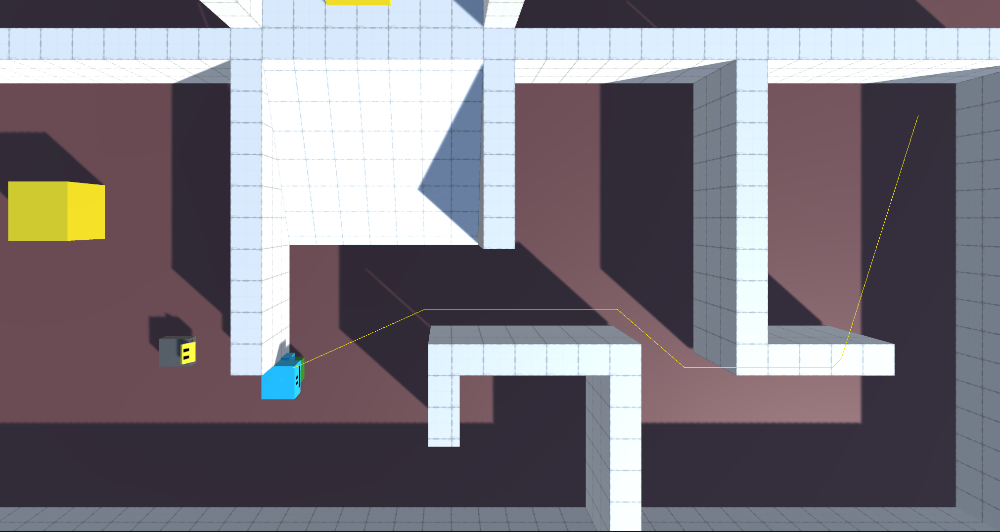

# COMP2160 Game Development – Prac Week 12

## Topics covered:
* NavMeshes
* NavMeshAgents
* NavMeshObstacles
* Gizmos

## LETs and LEUs
A reminder to please take a moment to complete the LETs and LEUs for this unit. This feedback is really important, and we need to reach a certain number of participants for us to see any of it. Please, if you have the time, fill them out.

## Today's Task
Today you will be implementing basic path-finding AI to move a player around using the mouse. You can play a sample solution [here](https://uncanny-machines.itch.io/comp2160-week-13a-prac).

Note: This is one of two "bonus pracs" you can complete in Week 13. You can only recieve marks for one of them. If you have already completed 12 practials, you will not receive any marks for this prac.

## Step 1 – Setup (10 min)

### Disable Lighting
Unity contains some sophisticated lighting code which takes time to bake. By default Unity automatically re-bakes lighting whenever you change the 3D scene. This can make editing very slow, so it is a good idea to turn off automatic baking when you start a new 3D scene.

Open the Lighting view (Window > Rendering > Lighting) and make sure the Auto Generate checkbox at the bottom of the panel is disabled:



When you have finished editing the scene, you can return to this window and press the <b>Generate Lighting</b> button to manually bake the lights. This should make editing much faster.

### ProBuilder
You should have experience with ProBuilder from COMP1150. It provides easy-to-use tools for constructing level geometry. We will use this to build an environment to navigate around.

ProBuilder should already be installed. However, if for some reason it isn’t, you can get it by following these steps:

* Open the Package Manager (Windows > Package Manager).
* Select Packages: Unity Registry from the dropdown.
* Select ProBuilder from the list and press the Install button. 
 


Use ProBuilder to create a space with a couple of rooms connected by open doorways. Don’t overthink this – we are simply using it to learn how NavMeshes work. Make sure any objects you create with Probuilder are children of the "World" object, so we can treat it as one piece of geometry.

The project contains a Player object with a simple script to move to any location you click on the ground plane, using Transform. Read through this script and make sure you understand how it works.

### Check Gizmos
We will need to have gizmos turned on in both our Scene and Game View to see the NavMesh and a few other things we're going to add today. These should be on by default, but if not turn them on in both windows by ensuring their corresponding buttons are pressed, like so:



## Checkpoint! Save, commit and push your work now.

## Step 2 – Creating a NavMesh (10 min)
At the moment, movement happens in straight lines and ignores obstacles. Your job is to replace this with a system that uses a NavMesh to do obstacle avoidance.

In the Inspector, mark all your terrain as Static. This is necessary to tell the NavMesh system which parts of the world are unchanging obstacles.

Open the Navigation view (Window > AI > Navigation). Select the Agents tab.

 

Check the agent’s Radius and Height match the dimensions of the Player (Note: This does NOT mean they are the same as the Scale units on the Player’s Transform!). 

Familarise yourself with the other parameters: <b>Max Slope</b> and <b>Step Height</b> determine what kind of inclines the agent is able to move up/down. The <b>Generated Off Mesh Links</b> such as <b>Drop Height</b> and <b>Jump Distance</b> allow you to determine how the agent may move across vertical or non-level terrain.

We now need to "bake" our NavMesh by selecting our level geometry and telling Unity this is a navigatable surface. Select the World object in the heirarchy (not its child object, the Ground). Then, press Add Component > NavMeshSurface. This tells Unity that this object is traversable, as well as all its children. When you press <b>Bake</b> on this component, you should see the NavMesh overlaid in blue on your level in the Scene view:


 
The parts of the map coloured blue indicate places where the agent can stand. If your level is well designed, all the blue areas should be connected. 

If a doorway is too small or a ramp or stair too steep, you may find your mesh is broken into several sections. Movement within a section will still work, but this may prevent agents from navigating from one part of the NavMesh to another. The connectivity of the NavMesh depends on the NavMesh's parameters. 

Experiment with the parameters and see how they affect the connectivity of the NavMesh. You can also try adding slopes or other additions to your terrain and re-baking to see how this impacts movement around your level. Everytime you add new parts to your geometry, press "Bake" to re-generate the NavMesh.

Note that while non-Static objects can be baked into a NavMesh, it is best practice to make all objects that shouldn't move Static to avoid any bugs.

## Checkpoint! Save, commit and push your work now.
 
## Step 3 – Control with a NavMeshAgent (30 min)
We now want to rewrite the movement script to make use of this NavMesh.

Make a copy of the ```MovePlayerSimple``` called ```MovePlayerNavMesh``` (Remember to change the class name!). Replace the script on the Player with this new version.

Add a NavMeshAgent component to the Player object.
 


These default settings will do for now. Now we need to edit the script to tell the agent where to go.

Edit the script to add the following:
* Add using ```UnityEngine.AI;``` at the top of the file to tell C# we will be using code from the AI package.
* Add a RequireComponent directive to make sure there is a NavMeshAgent on the object.
* In Start, get the NavMeshAgent component and store it in a private variable.

Remove the ```MoveToDestination()``` method from ```Update()``` and add the following to the ```GetDestination``` method when a new destination has been set:

```
agent.SetDestination(destination);
```
 
Where “agent” is the private variable you stored the NavMeshAgent component in. Make sure you've set the LayerMask on your new ```MovePlayerNavMesh``` script.

That’s all you need to do! The NavMeshAgent handles the rest: dynamically calculating the path and moving the agent based on the component's variables. Keep in mind you can now clean-up the code by removing non-necessary variables and methods.

## Step 4 – Dynamic NavMesh Obstacles (10 min)
Because it is baked, the NavMesh only includes static terrain. Test what happens with non-static objects:
* Create a cube and add a Rigidbody to it. Place it in the world so that it will be in the agent’s path. How does the Player interact with the cube?
* Add a NavMeshObstacle component to the cube. How does this change the interaction? What does the agent do if there is no easy way around the cube?

## Checkpoint! Save, commit and push your work now.

## To receive half marks for today, show your tutor:
* Your player movement controlled using a NavMeshAgent.
* Your baked NavMesh terrain.
* Your dynamic NavMesh obstacle.

## Step 5 – Add a Rigidbody (20 min)
The NavMeshAgent moves the Player directly using its Transform. This can be a problem if we want the agent to interact physically with the scene. 
* Add a Kinematic Rigidbody to the Player.
* Remove the NavMeshObstacle component from the Cube. How does interaction between the player and the cube work now?

Because the Rigidbody is kinematic, the interaction is one-way. The player affects the cube but not vice-versa.

Note: We probably want the AI to try and avoid dynamic objects like boxes in the world, but to have meaningful physics reactions if they do collide. Re-add the NavMeshObstacle component to the Cube while maintaining a Kinematic Rigidbody on the player to achieve this.

## Step 6 – Add a Follower (20 min)
In the Prefabs folder, you'll find a Prefab named Drone. Place it into the scene. Your challenge is to add a NavMeshAgent to them and write a script that makes them follow the player, like in the sample solution. How can you adjust the NavMeshAgent component on the Drone to make them stop before they hit the Player?

## Step 7 – Add a Gizmo (10 min)
Add a Gizmo to the game using the ```OnDrawGizmos()``` method to show the NavMeshAgent's current path. You can achieve this by using [```Gizmos.DrawLine()```](https://docs.unity3d.com/ScriptReference/Gizmos.DrawLine.html) and the [```NavMeshAgent.path```](https://docs.unity3d.com/ScriptReference/AI.NavMeshPath.html) variable (Hint: check out corners).

Your result should look something like this:


## Prac complete! Save, Commit and Push your work now.

## To receive full marks for today, show your tutor:
* A Kinematic Rigidbody and Rigidbody Obstacles.
* The follow drone.
* A Gizmo showing the Player's path.

## Bonus Round: Make the Rigidbody dynamic
A more tricky problem is to use rigidbody physics to move the player along the path given by the NavMeshAgent. This is difficult because the Rigidbody component and the NavMeshAgent component want to compete for control over the player.

One trick is to use two objects: a ‘physical’ player (controlled by a Rigidbody) and a ‘virtual’ player (controlled by a NavMeshAgent). The virtual player can be invisible and move along the path planned by the agent. You can then write a script to apply forces to the physical player to get it to follow the virtual player around.